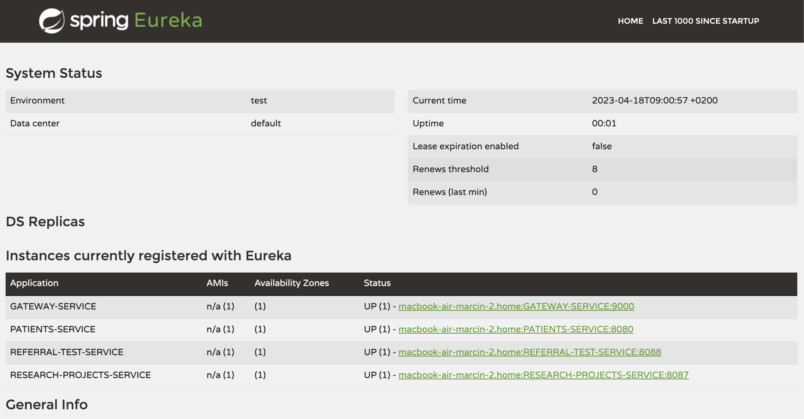
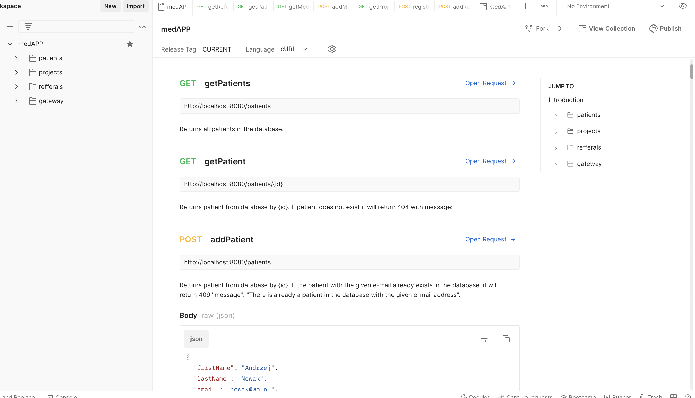

# REST API of the medical center

## Brief description of the project

The project is an application written in Java 17 using Spring Boot.
It is written in a microservices architecture. It consists of 5 microservices. It uses SQL H2 database and noSQL MongoDB.

## How to run a project on Linux/MacOS

Make sure you have Java 17 installed. Type "java -version" in the terminal. If the Java version starts with "17" e.g. "17.0.2" then everything is ok.
Then navigate through the terminal to the med-app folder. Then enter the command "sh kill.sh" this will kill the processes on the ports used by the application (8080, 8087, 8088, 8761, 9000). Then type "sh start.sh". This will start all microservices.
You can check if everything is up and running by typing "http://localhost:8761/" in your browser. You should see the Eureka console with 4 apps registered in it. Just like in the picture below.

## I can't run the app

If you can't run these applications with sh. Try using a compiler, IntelIiJ recommended. To do this, clone each project from these repositories.
https://github.com/mmplonski/eurekaService
https://github.com/mmplonski/gateway
https://github.com/mmplonski/researchProjectService
https://github.com/mmplonski/patientsService
https://github.com/mmplonski/referralService
Następnie uruchom je wszystkie za pomoca kompilatora.
Then run them all with the compiler.

## How to use the app.

If you have already started the application, you need an HTTP client. Recommended "Postman".
In the repository there is a file called "medAPP.postman_collection.json" to be imported into postman. It is a collection of prepared requests that allow communication with the application.

## Documentation

If you have imported the request file into postman, you can check the documentation that describes the endpoints. Click on the medApp folder and then on the lower right "View complete collection documentation"

